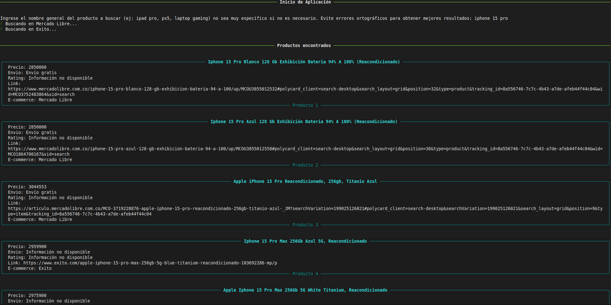

# E-commerce Price Scraper (Colombia)

> **A professional CLI tool to compare prices between Mercado Libre and Éxito using automated browser logic and statistical data cleaning.**

---

## Overview

Finding the best deal online in Colombia shouldn't be a manual task of opening multiple browser tabs. This project is a **Systems Engineering solution** designed to automate the search, extraction, and comparison of products from the leading e-commerce platforms in the country: **Mercado Libre** and **Éxito**.

By leveraging **Playwright** for asynchronous scraping and **Numpy** for data processing, the script simulates real user interaction, filters outliers (unusually low or high prices), and presents the top 3 results from each store in a clean, professional CLI format.

## Project Documentation

This project was developed following formal software engineering methodologies. You can review the detailed planning and design documents here:

* [Product Requirements Document (PRD)](./docs/PRD.md): Detailed problem statement, user requirements, and project scope.
* [Technical Design Document (TDD)](./docs/TDD.md): Technical architecture, data flow, and system specifications.

### Key Goals
* **Concurrency:** Runs multiple scrapers simultaneously using `asyncio` to minimize wait time.
* **Statistical Filtering:** Uses Interquartile Range (IQR) and Median filtering to remove irrelevant results or price anomalies.
* **Professional UX:** Renders high-quality visual components (Panels) in the terminal using the **Rich** library.

---

## Tech Stack

The project utilizes a specialized set of libraries to handle asynchronous operations, data analysis, and user interface management.

### Core Technologies
* **Python 3.10+**: The primary programming language, chosen for its robust support for asynchronous programming.
* **Playwright 1.58.0**: Selected for web automation and data extraction from dynamic content.
* **Numpy 2.4.4**: Implemented to perform statistical analysis and outlier removal on retrieved prices.
* **Rich 15.0.0**: Used to build the Command-Line Interface (CLI), rendering panels and progress bars.

### Architectural Principles
* **Asynchronous Concurrency**: Uses `asyncio` to execute multiple scraping tasks in parallel.
* **Modular Design**: Structured into independent modules (scrapers, processing, error_handler) to adhere to the Single Responsibility Principle.
* **Documentation Standards**: Follows PEP 8 and PEP 257 (docstrings) for high maintainability.

---

## Architecture and Workflow

The system follows a linear data pipeline to ensure data quality at every stage:

1. **User Input**: The system requests and sanitizes the product name to ensure valid search queries.
2. **Parallel Scraping**: Two simultaneous browser instances are launched via Playwright. Each scraper implements a 3-attempt retry logic to handle network instability.
3. **Statistical Filtering (Numpy)**: 
    * **IQR (Interquartile Range)**: Identifies and eliminates products with anomalous prices.
    * **Median Filter**: Removes items priced 20% below the median to filter out irrelevant accessories or parts.
4. **Ranking**: Products are sorted by price (ascending) and rating (descending), selecting the top 3 results per platform.

---

## Error Handling Strategy

The application implements a centralized error management system through the `error_handler` module to ensure consistent visual feedback.

* **Resilience**: Automatic retries (up to 3) for network or DOM loading issues.
* **Network Validation**: Detects connectivity at launch and terminates gracefully if unavailable.
* **Data Fallbacks**: If no products meet the 4-star requirement, the system informs the user and displays the highest-rated alternatives available.
* **Missing Attributes**: Handles missing ratings or titles by assigning 'NE' (No Existe) values to maintain data structure integrity.

---

## Preview

Below is an example of the CLI output using Rich Panels:

*Example: Search results showing ranked products from both e-commerce platforms.*

---

## Project Status (v1.0)

This first version extracts information directly from the search result cards. A known limitation is that some attributes (like specific stock details) may not be present in the main view. 

**Future Updates:**
* Deep-crawl implementation to extract details from individual product pages.
* Support for additional e-commerce platforms in Colombia.
* History log of previous comparisons.

---

## Author

**Miguelangel Velez Aguirre**
* Systems Engineering Student at Universidad de Antioquia (UdeA)
* [LinkedIn Profile](https://www.linkedin.com/in/miguelangel-v%C3%A9lez-aguirre-235982168/) | [GitHub Portfolio](https://github.com/miguelvelezsk?tab=repositories)
